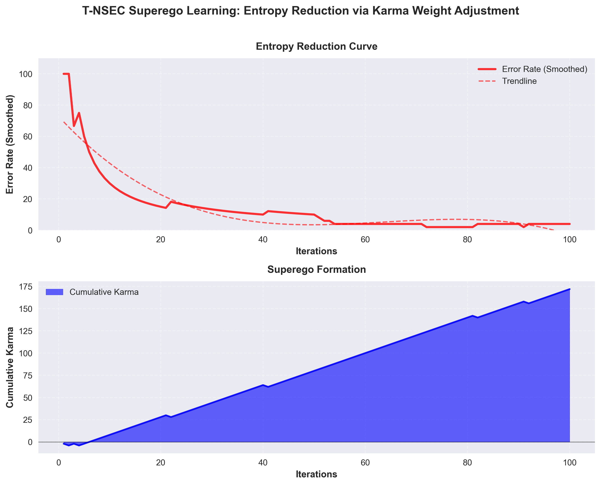

# 4. [Flagship] TK‑APO：时间‑业力异步偏好优化（无梯度持续学习）

## 一句话

用“时间衰减 + 图谱权重（Karma）更新”替代梯度更新，让个性化持续学习发生在 **外部记忆** 上，并具备可解释的信用分配。

## Abstract (摘要)

- **核心机制**：Karma 随时间衰减（遵循遗忘曲线），反馈随交互异步注入。
- **研究目标**：缓解灾难性遗忘 (Catastrophic Forgetting)，同时保持边缘侧轻量化部署。

## 一个最小公式

设边 \(e\) 的业力权重为 \(K_e(t)\)：

\[
K_e(t)=K_e(0)\cdot e^{-\lambda t}+\sum_{i=1}^{n(t)}\Delta K_{e,i}
\]

其中 \(\lambda\) 控制遗忘速度，\(\Delta K\) 来自正/负反馈的异步更新。

## 论文贡献点

1. **图谱权重演化 = 低功耗持续学习**：学习发生在结构化记忆而非模型参数
2. **可解释信用分配**：每次命中路径可形成 Decision Trace
3. **工程可行**：权重更新是常数时间/稀疏更新，适合边缘设备

## 研究范围与口径 (Scope & Definitions)

- **BWT 口径**：若未按标准任务序列定义计算，需要明确写为 *BWT-like proxy*，并给出标准 BWT 的后续计划。

## 实验计划（Planned）

- **"无为推理"噪声实验**（待验证）：100 条消息，50 条噪声；目标是自动学会静默，从而节省算力
- **Karma 演化曲线**：对稳定偏好（长期）与短期偏好（近期）分别展示衰减与强化
- **任务序列**：至少 5 个任务块，报告 forgetting curve + BWT/FWT

---

## 已跑通的最小闭环证据（PoC）

### Superego（超我）学习曲线：Karma 权重熵减（无梯度）

- **一句话**：用“正确/错误反馈 → Karma 稀疏更新 → 行为概率偏置”实现错误率下降，展示 **外部权重演化** 可以先于梯度更新发生。
- **证据页**：`../appendix/CaseStudy_Superego_Karma_Learning.md`
- **脚本**：`examples/superego_test.py`
- **图表**：`docs/assets/superego_learning_curve.png`

> 说明：该实验是概念验证（PoC），用于验证机制的可解释性与可复现性；标准 Continual Learning 任务序列与 BWT/FWT 对比作为后续工作。

