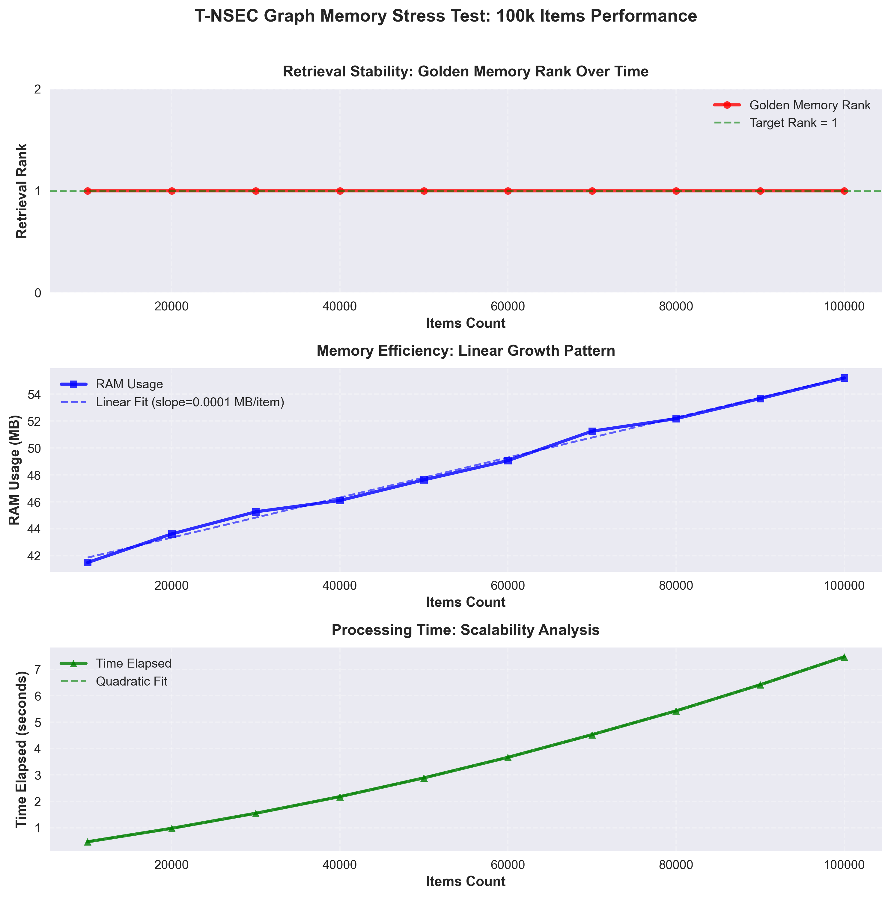

# 5. SGE & U‑SGE：面向跨域类比的拓扑感知稀疏图编码

## 一句话

用 **加权图谱 + 拓扑检索** 替代“把一堆文本塞进输入上下文”：SGE 做稀疏召回与上下文压缩，U‑SGE 在其上增加“元概念桥梁”，把跨域类比变成可计算问题。

## Abstract (摘要)

- **SGE**：Topology-aware sparse retrieval / context compression
- **U‑SGE**：Meta‑Concept alignment（“说人话”的抽象层），支持跨域同构映射

## 论文贡献点

1. **压缩**：在有限上下文窗口下实现拓扑剪枝与子图构造
2. **解释性**：子图路径即解释（Decision Trace）
3. **类比**：通过元概念层将“结构相似”而非“词相似”的问题建模

## 实验计划（Planned）

- **对比**：Standard RAG vs SGE（Multi-hop QA：准确率/Token 消耗）
- **消融**：w/o Karma 权重、w/o 拓扑扩展、w/o 元概念层

---

## 已跑通的工程级证据（可引用）

### Graph Memory 10 万项压力测试：检索不塌缩（Retrieval Collapse Audit）

- **一句话**：在 10k→100k 项持续插入的压力下，目标“Golden Memory”保持 **Rank=1**，未出现 retrieval collapse。
- **证据页**：`../appendix/CaseStudy_StressTest_100k.md`
- **CSV**：`benchmark/stress_test_100k.csv`
- **图表**：`docs/assets/stress_test_100k.png`

> 口径说明：该压测使用 `MockEmbedder`（随机向量）验证“存储/索引/相似度检索”路径的可扩展性；语义检索质量需要在真实 embedding 下另行评测（可作为后续实验）。

